  

 

  

 

  

 

  

 

<strong>More about me</strong>

 

Building tools that solve real problems for Brazilian businesses.
TypeScript, React, Next.js, NestJS, PostgreSQL, AI integrations.

**Founder** @ [TrianguloTEC](https://triangulotec.com.br) — Minas Gerais, Brasil

*"Slow is Fast"*

 

  
  
  

